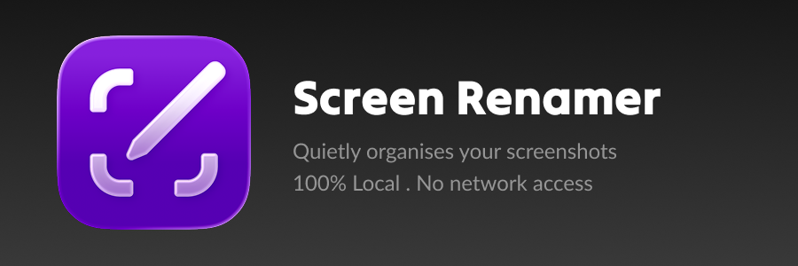

Screen Renamer is a tiny macOS menu bar utility that automatically renames screenshots into meaningful, human-readable filenames using local OCR plus the app, window, browser tab, and browser domain you captured.

  

Instead of files like:

  

```text

Screenshot 2026-05-25 at 08.57.15.png

```

  

you get names like:

  

```text

Figma_Login_Flow.png

Safari_Amazon_Checkout.png

Finder_Game_Assets.png

Chrome_Research_Notes.png

ConflictResolution_Rule3_GitHub.png

Year8_Science_Timetable_GoogleSheets.png

```

  

The goal is simple: take screenshots as usual, then let the app clean up the filenames quietly in the background.

  

## Why

  

macOS screenshots are easy to create but hard to find later. Default screenshot filenames tell you when a screenshot was taken, but not what it was about. Screen Renamer keeps screenshots searchable using visible text in the image and context that already exists on your Mac: the foreground app, focused window title, selected browser tab, and browser domain where available.

  

The app is intentionally local-first:

  

- No internet access

- No cloud service

- No analytics

- No image upload

- No cloud OCR, LLMs, or AI naming

- Native Apple Vision OCR runs locally on your Mac

  

## Features

  

- Runs as a native macOS menu bar app

- Watches the Desktop by default

- Follows the macOS screenshot save location when one is configured

- Detects new screenshots and renames them automatically

- Quietly creates app-specific folders after repeated screenshots from the same app

- Uses a short rolling app/window context buffer to avoid app-switch timing mistakes

- Reads browser tab and domain context where macOS Accessibility APIs expose it

- Uses the macOS Vision framework to extract visible text from screenshots locally

- Scores OCR text deterministically using confidence, bounding boxes, centrality, size, and noise filtering

- Extracts browser domains when available to avoid noisy or duplicate filename segments

- Sanitizes filenames for macOS compatibility

- Cleans noisy titles by removing raw URLs, browser domains, app suffixes, and low-quality placeholders

- Avoids overwriting existing files by adding an incrementing suffix

- Supports pause and resume from the menu bar

- Can launch at startup

- Writes a local debug log to help diagnose missed or unexpected renames

  

## How It Works

  

Screen Renamer has seven main pieces:

  

1. `ContextTracker` records the frontmost app, focused window title, selected browser tab, and browser domain every 500 ms. It also listens for app activation events so fast app switches are captured promptly.

2. `ScreenshotWatcher` watches the screenshot save folder, waits briefly for new files to finish writing, then schedules them for processing.

3. `ContextMatcher` matches the screenshot timestamp to the best available recent context.

4. `OCRProcessor` runs a local `VNRecognizeTextRequest` against the screenshot and returns structured OCR tokens with text, confidence, and bounding boxes.

5. `NoiseFilter` and `TextScorer` discard menu-bar/browser-chrome junk and rank meaningful visible phrases.

6. `FilenameGenerator` prefers high-confidence OCR phrases for names such as `ConflictResolution_Rule3_GitHub.png`, then falls back to context names such as `Chrome_GitHub_Pull_Request.png` when OCR is weak or empty.

7. `ScreenshotOrganizer` quietly creates folders such as `Chrome_Screenshots` once an app accumulates enough screenshots, moves the earlier files, and keeps future screenshots for that app together.

  

The app only renames newly detected screenshots. It does not batch-process older screenshots that existed before the watcher started.

Automatic app folder organization begins after 5 screenshots from the same app. The first few screenshots stay in the normal save location; when the threshold is reached, Screen Renamer creates the app folder and moves the matching renamed screenshots there in the background.

OCR naming is intentionally conservative. The app selects only a few semantic chunks, favors larger and more central text, penalizes menu bar and browser chrome noise, and keeps output deterministic. If the OCR result is low confidence or not meaningful, the screenshot is renamed with the existing app/window/tab fallback path instead.

  

## Privacy

  

Screen Renamer runs entirely on your Mac. It does not send screenshot names, window titles, URLs, images, OCR text, logs, or any other data to a server.

  

The app asks for Accessibility access because macOS requires it before an app can read the active app and window title. OCR uses Apple's local Vision framework. Both signals are used only locally to generate filenames.

  

## Requirements

  

- macOS 13 Ventura or newer

- Xcode with a macOS 13 SDK or newer

- Swift 5

- No Node.js, npm, or third-party Swift packages are required

- No network access, OCR service, or model download is required

  

## Installation

  

### From Source

  

Clone the repository:

  

```sh

git clone https://github.com/abhiramansuresh/screenshot-renamer.git

cd screenshot-renamer

```

  

Open the Xcode project:

  

```sh

open "Screen Renamer.xcodeproj"

```

  

In Xcode:

  

1. Select the `Screen Renamer` scheme.

2. Choose your Mac as the run destination.

3. Press `Cmd+R` to build and run.

4. Grant Accessibility access when prompted.

  

You can also build from the command line:

  

```sh

xcodebuild \

-project "Screen Renamer.xcodeproj" \

-scheme "Screen Renamer" \

-configuration Release \

-destination "platform=macOS" \

clean build

```

  

The release app is written to:

  

```text

Prod/Screen Renamer.app

```

  

Copy `Prod/Screen Renamer.app` to `/Applications`, launch it, and grant Accessibility access in:

  

```text

System Settings -> Privacy & Security -> Accessibility

```

  

If macOS still shows stale permission state after replacing the app, remove the old Screen Renamer entry from Accessibility settings, then add the app again.

  

## Usage

  

1. Launch Screen Renamer.

2. Grant Accessibility access.

3. Take screenshots normally with macOS.

4. New screenshots in your screenshot save folder will be renamed automatically.

  

The menu bar item shows the most recent rename and total screenshots renamed. From the menu you can:

  

- Pause renaming for 5 minutes, 1 hour, until tomorrow, or indefinitely

- Resume renaming

- Enable or disable launch at startup

- In debug builds, open or clear the debug log

  

The debug log is stored at:

  

```text

~/Library/Application Support/Screen Renamer/debug.log

```

  

## Screenshot Save Location

  

Screen Renamer watches the Desktop by default. If you changed the macOS screenshot location, the app attempts to read it from:

  

```text

com.apple.screencapture

```

  

To change the system screenshot location yourself, press `Cmd+Shift+5`, choose `Options`, then select a save location.

  

## Filename Rules

  

When OCR has enough signal, generated names use this general shape:

  

```text

[KeyPhrase1]_[KeyPhrase2]_[AppOrSite].[extension]

```

  

Examples:

  

```text

Visible text "ConflictResolution_TestDriveCrawl.md" + "Rule 3" on GitHub -> ConflictResolution_TestDriveCrawl_Rule3_GitHub.png

Visible text "Year 8 Science Timetable" in Google Sheets -> Year8_Science_Timetable_GoogleSheets.png

Visible text "PDA: Onboarding / Figma?" -> PDA_Onboarding_Figma.png

```

When OCR is weak or empty, Screen Renamer falls back to context naming:

```text

[App]_[Page_Or_Window_Title].[extension]

```

Examples:

```text

Google Chrome + "GitHub Pull Request" -> Chrome_GitHub_Pull_Request.png

Microsoft Edge + "Research Notes" -> Edge_Research_Notes.png

Finder + "Game Assets" -> Finder_Game_Assets.png

```

  

The generator:

  

- Selects only a few high-scoring OCR chunks

- Penalizes menu bar text, browser chrome, timestamps, repeated fragments, and tiny UI labels

- Normalizes app names like `Google Chrome` to `Chrome`

- Prefers selected browser tab names when available

- Falls back to the focused window title

- Removes browser domains and common app suffix noise

- Shortens long titles and search queries

- Preserves common acronyms like `API`, `JSON`, `UI`, and `PDF`

- Limits generated base filenames to 80 characters

  

Supported screenshot file extensions:

  

```text

png, jpg, jpeg, heic, tiff, pdf

```

  

## Packaging For Distribution

  

For local testing, the command-line Release build is enough:

  

```sh

xcodebuild \

-project "Screen Renamer.xcodeproj" \

-scheme "Screen Renamer" \

-configuration Release \

-destination "platform=macOS" \

clean build

```

  

Then package the built app as a zip:

  

```sh

ditto -c -k --keepParent "Prod/Screen Renamer.app"  "Prod/Screen Renamer.zip"

```

## Project Structure

  

```text

Screen Renamer/

App/

ScreenRenamerApp.swift

AppController.swift

Info.plist

Models/

AppContext.swift

OCRToken.swift

Services/

ContextMatcher.swift

ContextTracker.swift

DirectoryWatcher.swift

FilenameGenerator.swift

NoiseFilter.swift

OCRProcessor.swift

LoginItemManager.swift

PermissionManager.swift

ScreenshotDebugLogger.swift

ScreenshotLocationResolver.swift

ScreenshotOrganizer.swift

ScreenshotProcessor.swift

ScreenshotWatcher.swift

TextScorer.swift

UI/

MenuBarView.swift

Screen RenamerTests/

OCRNamingTests.swift

```

  

## Development Notes

  

- Minimum macOS version is set to 13.0.

- Bundle identifier is `com.amorphicLabs.ScreenshotRenamer`. This is a legacy identifier retained so existing macOS Accessibility permissions continue to match after the product rename.

- The app uses `LSUIElement` so it appears as a menu bar utility instead of a Dock app.

- Release builds are configured to output to `Prod/`.

- Debug builds are configured to output to `Debug/`.

- Build artifacts and local Xcode state are ignored by `.gitignore`.

  

## Known Limitations

  

- The MVP assumes English macOS screenshot filenames beginning with `Screenshot`.

- OCR currently starts with English text recognition and conservative deterministic scoring.

- It does not rename screenshots that existed before the app started watching.

- Context quality depends on what macOS Accessibility APIs expose for the foreground app.

- Browser tab and domain extraction can vary by browser and browser version.

  

## Roadmap Ideas

  

Potential future improvements:

  

- Preferences UI

- Batch rename for existing screenshots

- Optional filename format customization

- Optional privacy controls for sensitive apps or private workflows

- Localization support for non-English screenshot filenames

- More robust browser metadata support

- Optional Finder integration

  

## Contributing

  

Issues and pull requests are welcome once the repository is public. Please keep changes aligned with the core product principles:

  

- Local-first

- Lightweight

- Native macOS feel

- Reliable over clever

- No network dependency for core behavior

  

## License

  

This project is licensed under the MIT License. See [LICENSE](LICENSE) for the full license text.
